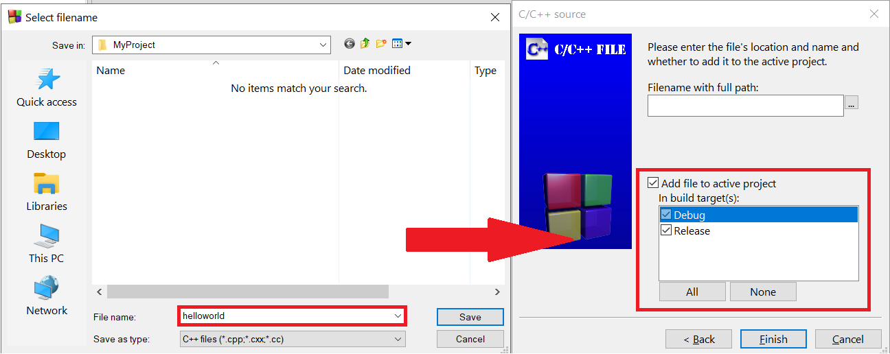

# C++ Installation Guide

## Stopgap solution

If installing really isn't working, you can rely on an [online C++ compiler](https://www.onlinegdb.com/online_c++_compiler) for now.

## Windows

### With VS Code

[Download Link](https://code.visualstudio.com/Download)

Watch video [here](https://www.youtube.com/watch?v=aVqZ3lZD8Qk).

### With CodeBlocks

#### Download link

[Codeblocks + Compiler](https://sourceforge.net/projects/codeblocks/files/Binaries/20.03/Windows/codeblocks-20.03mingw-setup.exe)

[Non Admin: CodeBlocks](https://sourceforge.net/projects/codeblocks/files/Binaries/20.03/Windows/codeblocks-20.03-setup-nonadmin.exe)

[Non Admin: Compiler](https://sourceforge.net/projects/mingw-w64/files/Toolchains%20targetting%20Win32/Personal%20Builds/mingw-builds/installer/mingw-w64-install.exe)

#### Guide

There will be 2 pop-ups. The first pop-up should include details on compiler selected (make sure there is GCC compiler detected!), select *ok*. The second pop-up is as shown below, select the following option.


Go ahead and *create a new project*.


Select *Empty Project*.


Choose a directory and name for your project. Select the following compiler options.

|||
|:--:|:--:|
|Project Options|Compiler Options|

Click the following options, and create `helloworld.cpp` file within the project.

|||
|:--:|:--:|
|Creating File|Pick C/C++ Source File|
|:--:|:--:|
|||
|:--:|:--:|
|Pick C++ File|Name file as `helloworld.cpp`|

#### Hello World Program!

Click *+* to expand `MyProject` and double click `helloworld.cpp` on the left to edit it. Add the following code:

```
#include <iostream>
using namespace std;

int main() {
    cout << "Hello world!";
    return 0;
}
```

Now you can *build & compile your code*! An `.exe` should run and you should see the following output:

|||
|:--:|:--:|
|Compiling code|Exectuable|

Congratulations if you made it here! You have successfully ran your first C++ Program!

## MacOS

### With VS Code

[Download Link](https://code.visualstudio.com/Download)

Watch video [here](https://www.youtube.com/watch?v=KhGnYWplLVo).

### With CodeBlocks

#### Download link

[MacOS: CodeBlocks](https://sourceforge.net/projects/codeblocks/files/Binaries/13.12/MacOS/CodeBlocks-13.12-mac.zip)

Watch video [here](https://www.youtube.com/watch?v=_bKLttPVoC8).
